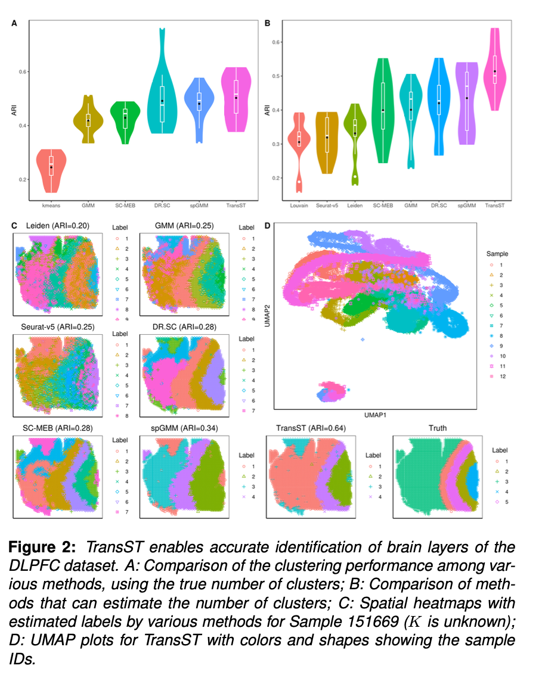

 

  <h2 style="font-weight: bold;">TransST</h2>

  <h2>🚧 Under Construction 🚧</h2>
  
We are building our website... Please check back soon for updates. Thank you for your patience!

 
 
<h3 style="font-weight: bold;">Description</h3>
TransST effectively transfers cell clustering information from known datasets to new, unlabeled ST datasets. By using a source dataset with well-annotated cell types—either from scRNA-seq or relevant ST studies—TransST uncovers cell heterogeneity in the target ST data.
 
 

<h3 style="font-weight: bold;">Code</h3>
🚧 Website Under Construction… 🚧
 
 

<h3 style="font-weight: bold;">Workflow diagram</h3>
🚧 Website Under Construction… 🚧
 
 

 
 
 
 

---
`[^1]:`{=markdown} Developed by Hu Lab and Collaborators.

