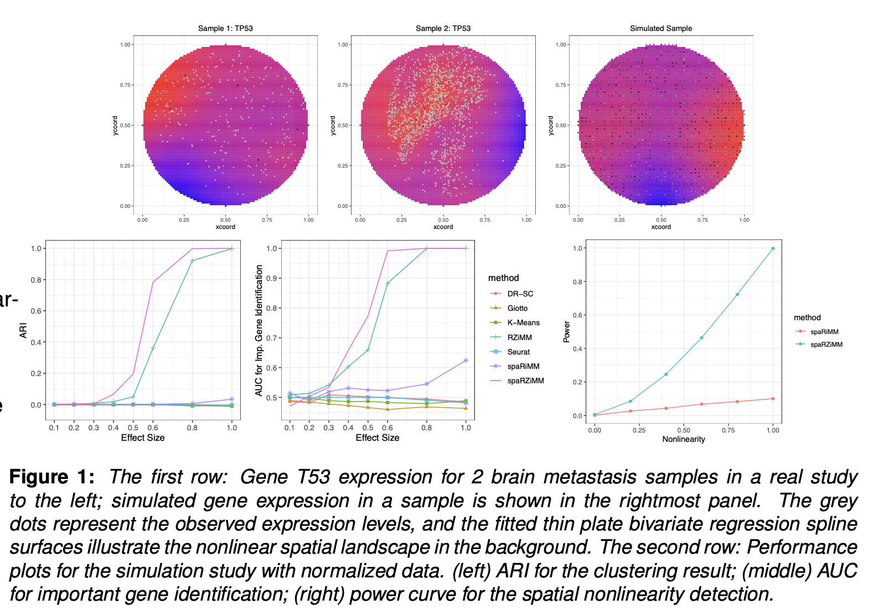

 

  <h2 style="font-weight: bold;">spaRZiMM</h2>

  <h2>🚧 Under Construction 🚧</h2>
  
We are building our website... Please check back soon for updates. Thank you for your patience!

 
 

<h3 style="font-weight: bold;">Description</h3>
spaRZiMM uniquely combines spatial information with gene expression, improving clustering accuracy and gene identification compared to existing techniques. This makes it a valuable tool for researchers studying complex tissue architectures in both high-resolution single-cell and lower-resolution multiple-cell data contexts.
 
 

<h3 style="font-weight: bold;">Code</h3>
🚧 Website Under Construction… 🚧
 
 

<h3 style="font-weight: bold;">Workflow diagram</h3>
🚧 Website Under Construction… 🚧
 
 

 
 
 
 

---
`[^1]:`{=markdown} Developed by Hu Lab and Collaborators.

